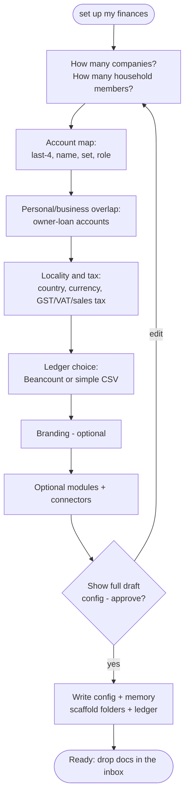
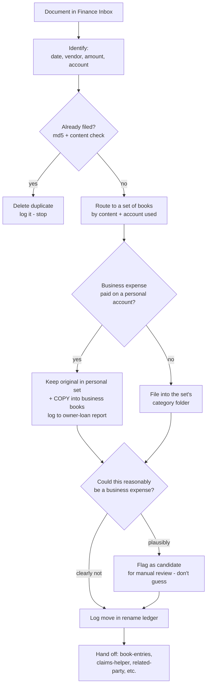

# Finance Organizer — What It Is and How It Works

A complete guide to the **finance-organizer** Cowork plugin: what it does, how the pieces fit, worked examples you can copy, and how to extend it with new skills.

> **One-line summary:** You drop financial paperwork into a folder and talk to Claude in plain language ("clear my inbox", "book last month", "show my P&L"). The plugin files every document into the right set of books, keeps a clean ledger, and produces statements — all driven by a one-time setup interview, and it asks before it ever remembers anything new.

---

## 1. The big idea

Most bookkeeping tools force your business into their structure. Finance Organizer works the other way around: a short **onboarding interview** captures *your* structure once, writes it to a config file, and then **every skill reads that config**. The same engine works whether you're a sole proprietor with one bank account or a family running two companies with shared accounts.

Four principles run through everything:

1. **Config-driven.** Your structure lives in `.finance-organizer/config.yaml` in your own working folder. Skills never hardcode your accounts, names, or tax rules — they read them from the config. Nothing about you is baked into the plugin.
2. **Sets of books, kept separate.** Each company and each tracked household member is its own "set of books" with its own ledger. They're never mixed; cross-overs are handled explicitly as loans between owner and business.
3. **Confirm before saving.** When the assistant learns something new (a vendor's category, a new account, a rule), it proposes it and waits for your "yes" before writing it to memory. Nothing is remembered silently.
4. **Portable and safe.** Scripts take paths and values as arguments — no machine-specific paths. It never connects a tool or moves money on your behalf; it guides you to do those things yourself.

---

## 2. Architecture at a glance

```mermaid
flowchart TD
    A[finance-onboard<br/>setup interview] -->|writes| C[(.finance-organizer/<br/>config.yaml · memory.md · brand.md)]
    C -. every skill reads .-> CORE
    subgraph CORE[Core skills]
        FI[file-inbox] --> BE[book-entries]
        BE --> RP[reports]
        FE[flag-expense]
    end
    subgraph OPT[Optional modules - toggled in config]
        RPY[related-party]
        CH[claims-helper]
        PP[payment-plan]
        BO[brand-output]
        SF[sync-financials]
    end
    CORE --- OPT
    LEARN[learn<br/>confirm-before-save] -. invoked by any skill .- CORE
    LEARN -. .- OPT
```

The config file is the contract. `finance-onboard` writes it; everything else consumes it.

---

## 3. Getting started — the onboarding flow

You run onboarding once by saying something like **"set up my finances"**. It's a ~15-minute plain-language interview, one question at a time, and it shows you everything before writing it.



What it captures (mapped to the config):

- **Sets of books** — one *business* set per company, one *personal* set per tracked household member, each with a fiscal year-end.
- **Account map** — each account's last 4 digits (never the full number), a friendly name, which set it belongs to, and its role (operating / savings / card / line-of-credit / tax).
- **Overlap** — the accounts used when business pays a personal cost or vice-versa (tracked as an owner loan, not an expense).
- **Locality & tax** — country, region, currency, and tax registrations (rate + filing cadence). It records what you tell it and flags anything to confirm with your accountant rather than asserting tax law.
- **Ledger backend** — Beancount (recommended; plain-text and auditable) or a simple spreadsheet/CSV ledger for non-technical users.
- **Modules** — which optional features to switch on (below).

On a return visit it never re-interviews — it loads your config, shows the profile, and changes only what you tell it.

---

## 4. The skills — everything it can do

| Skill | Say something like… | What it does |
|---|---|---|
| **finance-onboard** | "set up my finances", "get me started" | The setup interview. Writes config + memory + branding, scaffolds folders and the ledger, and offers a nightly inbox routine. |
| **file-inbox** | "clear my inbox", "file these" | Routes each document to the right set of books, names it by the convention, de-duplicates via a rename ledger, files it, and hands eligible items to other skills. |
| **book-entries** | "book last month", "do my entries", "reconcile" | Posts ledger entries (Beancount or simple) per your config, validates them, books when confident, and flags when unsure. |
| **flag-expense** | "flag that as a business expense" | Annotates a transaction for later review **without** rebooking it — flag, don't guess. |
| **reports** | "show my P&L", "balance sheet", "where did my money go?" | Produces an income statement, balance sheet, and a plain-English summary from the ledger. |
| **related-party** *(opt)* | "reimbursement owed", "we paid X's bill" | Tracks contributions and reimbursements between your entities; flags misdirected payments. |
| **claims-helper** *(opt)* | "add this to my claim" | Maintains a per-period claims tracker/form (e.g. a health-spending account) and carries it forward each period. |
| **payment-plan** *(opt)* | "build a payment plan" | Batches invoices within a configurable daily transfer limit, saves a plan, and adds calendar reminders. |
| **brand-output** *(opt)* | "make an invoice/report" | Applies your captured branding to generated documents. |
| **sync-financials** *(opt)* | "sync Square/QuickBooks", "import my sales" | Pulls invoices/sales from connected payment tools and reconciles against your accounting tool — tool-agnostic. |
| **learn** | (any skill triggers it) | Proposes saving a new rule/mapping to memory or config — always confirm-before-save. |

---

## 5. How a document flows through filing

This is the heart of day-to-day use. You drop a PDF/receipt into the Finance Inbox and say **"clear my inbox"**.



Two behaviors worth calling out, because they prevent year-end headaches:

- **Personal-account business expenses get a copy in the business books.** The original stays where the money came from (your personal set), and a copy lands in the business set's `Expenses/Paid on Personal Accounts/` folder, logged against the owner-loan. At year-end your accountant has both the totals *and* the supporting invoices in one place. (Travel receipts are the one exception — they stay with their trip and are cross-referenced.)
- **It reasons about business use and flags candidates.** For anything on a personal account, it actively judges whether it could reasonably be a business expense (given your business and your tax rules) and flags it for your review rather than silently treating it as personal — and it never books a flagged candidate until you confirm.

---

## 6. Worked examples (generic)

These use a made-up sole proprietor, "Alex", who runs one consulting company plus a personal set of books. Copy the prompt style; the assistant fills in from your config.

### Example A — First-time setup
> **You:** set up my finances
>
> **Assistant:** *(interview)* How many companies should I track, and how many household members? …
>
> *(After the interview it shows the full draft config, you approve, and it scaffolds folders + a starter ledger.)*

### Example B — Clearing the inbox
> **You:** *(drop three PDFs in the Finance Inbox)* clear my inbox
>
> **Assistant:** Filed 3 items —
> - `2026-03-02 CloudHost 24.00.pdf` → Business / Expenses / Software. Flagged as a likely business expense (web hosting).
> - `2026-03-04 City Parking 12.00.pdf` → Personal / Receipts. Paid on a personal card, but parking at a client site — **flagged as a candidate** for your review.
> - A duplicate of last month's phone bill → deleted (already on file).

### Example C — Booking a month
> **You:** book February
>
> **Assistant:** Posted 18 transactions to the Beancount ledger and ran validation — 0 errors. One transaction was ambiguous (a $40 transfer) so I flagged it rather than guessing. Want to review it?

### Example D — Reports
> **You:** show my P&L for Q1
>
> **Assistant:** *(income statement + balance sheet + a plain-English summary: revenue, top expense categories, and what changed vs last quarter.)*

### Example E — An optional module (related-party)
> **You:** I paid the other company's hosting bill from my personal card — log that
>
> **Assistant:** Recorded as a reimbursement owed in the related-party report (not rebooked). It'll show in "what's outstanding" until it's settled.

### Example F — Sync from a connected tool
> **You:** sync my Square sales for last week
>
> **Assistant:** Pulled 12 settled sales from your connected payments tool and staged them into the inbox/ledger flow, reconciled against your accounting tool. (It never connects the tool for you — you link it once in your connector settings.)

---

## 7. The config file (generic example)

Everything keys off this file in your working folder. A trimmed example:

```yaml
sets_of_books:
  - id: business
    label: "Alex Consulting"
    type: business
    fiscal_year_end: "12-31"
  - id: personal
    label: "Alex (personal)"
    type: personal
    fiscal_year_end: "12-31"

accounts:
  - last4: "1111"
    name: "Business chequing"
    set: business
    role: operating
  - last4: "2222"
    name: "Personal Visa"
    set: personal
    role: card        # sometimes used for business → overlap

overlap:
  shareholder_loan_account: "Liabilities:Current:DueToShareholder"
  due_from_business_account: "Assets:DueFromBusiness"
  personal_card_expense_doc: "Alex Consulting/Reports/Expenses Paid on Personal Cards.md"
  personal_card_expense_copies_dir: "Alex Consulting/Expenses/Paid on Personal Accounts"

tax:
  registrations:
    - { kind: "GST/HST", number: "…", rate: 0.05, filing: "annual" }

modules:
  related_party: false
  claims_helper: false
  payment_plan: false
  brand_output: false
  integrations: false
```

See `references/config-schema.md` for the full schema and `references/config.example.yaml` for a complete worked example.

---

## 8. Ledger backends

- **Beancount (recommended).** Plain-text, double-entry, auditable. Onboarding can install it and scaffold a valid starter ledger for you. Best if you want real statements and an audit trail.
- **Simple CSV.** A spreadsheet-style ledger for non-technical users. Lower power, zero learning curve.

Either way, the `reports` skill produces everyday statements. For enterprise-grade close/GAAP/variance/audit, onboarding can point you to the separate **finance** plugin — most people don't need it.

---

## 9. Privacy & safety model

- **Your data stays in your folder.** The config, memory, and ledgers live in your working folder, not in the plugin.
- **Last-4 only.** Account numbers are stored as the last four digits, never in full.
- **Confirm before saving.** New rules/mappings are proposed, not silently written.
- **Never moves money, never auto-connects.** It guides you to link tools and to make transfers; it does not do either on your behalf.
- **Flags instead of guessing.** When something is ambiguous — especially business-vs-personal — it flags for review rather than booking it.

---

## 10. Extending it — prompt Claude to build new skills

The plugin is just structured Markdown + small scripts, so you can grow it by **asking Claude to add to it** in a Cowork session (the `skill-creator` skill helps, but plain requests work too). Point Claude at the plugin folder and describe the new capability.

### Anatomy of a skill (so your requests land well)

```
finance-organizer/
  skills/<your-skill>/SKILL.md     # frontmatter (name + description) + the procedure
  scripts/<helper>.py              # optional, argument-driven (no hardcoded paths)
  references/<topic>.md            # optional shared reference
  .claude-plugin/plugin.json       # bump the version
```

A `SKILL.md` has YAML frontmatter with a `name` and a trigger-rich `description`, then a plain procedure that **reads `.finance-organizer/config.yaml` first** and follows the same conventions (route → name → dedup → log → hand off; confirm-before-save).

### Example prompts to expand it

- **A new module:**
  > "Add an optional `mileage` module to finance-organizer. Create `skills/mileage-log/SKILL.md` that reads a trips CSV from the inbox, applies the per-km rate from a new `mileage.rate` config key, books the reimbursement to the owner-loan account, and flags anything ambiguous. Add the config key to `config-schema.md` and `config.example.yaml`, wire `modules.mileage` into onboarding, and bump the version."

- **A new report:**
  > "Add a `quarterly-tax` skill that totals taxable sales and the input-tax credits from the ledger for a quarter using `config.tax`, and writes a one-page summary an accountant can use. Follow the existing `reports` skill's structure."

- **A new document type in filing:**
  > "Teach `file-inbox` to recognize utility bills and split out the business-use share into the owner-loan report, using a `home_office.percent` config value. Update `conventions.md` to document the rule."

- **A new integration:**
  > "Generalize `sync-financials` to also pull from a bank-feed connector when `integrations.bank_feed` is true, staging transactions into the inbox flow. Keep it tool-agnostic and never connect on the user's behalf."

- **Improve triggering:**
  > "Review every SKILL.md description and make the trigger phrases broader so the right skill fires from natural requests. Use the skill-creator skill to test."

When you ask, Claude edits the files in place, you review, and you commit/push as usual. Keep three habits and new skills will behave like the built-ins: **read the config first, confirm before saving, and flag instead of guessing.**

---

## 11. Installing & sharing

Friends can install in either of two ways:

1. **Marketplace (recommended):** Settings → Capabilities → Plugins → add marketplace → from repository, then enable `finance-organizer`. Updates flow through git.
2. **`.plugin` file:** install the packaged `finance-organizer-<version>.plugin` directly.

Then they just say **"set up my finances"** and the onboarding takes it from there.

---

*Finance Organizer is a generalized, shareable tool. It contains no personal accounts, names, or figures — your information lives only in your own working folder.*
